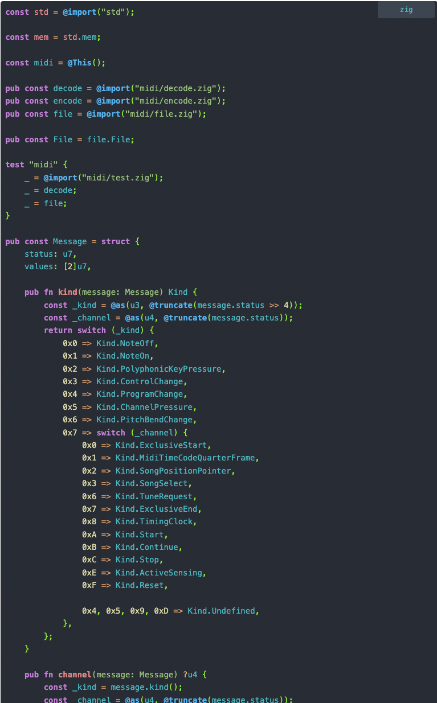

# highlightjs-zig

## Description

Zig - a language grammar for highlightjs

Performance:



### Usage for Node or another

```javascript
var hljs = require('highlightjs');
var hljsZig = require('highlightjs-zig');
require('src/zig.style.css')

hljs.registerLanguage("zig", hljsZig);
hljs.highlightAll();
```
